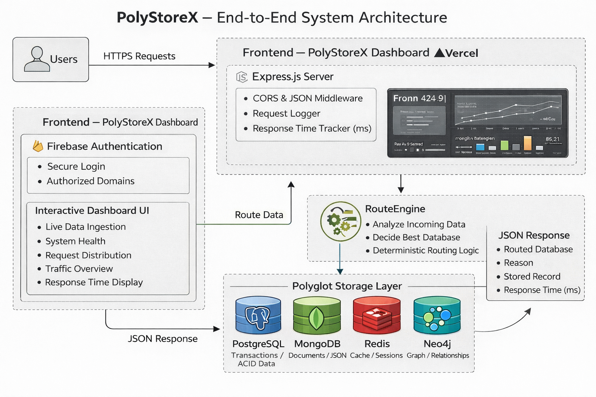

# 🚀 PolyStoreX — Intelligent Polyglot Data Store & Observability Platform

PolyStoreX is a **full-stack intelligent polyglot data management prototype** that automatically routes incoming data to the **most suitable database system** (SQL, NoSQL, Cache, Graph) based on data semantics — while providing **real-time observability, metrics, and response-time monitoring** through a modern dashboard.

This project is built as a **working, production-style prototype**, not a mock UI. Every request is processed, routed, stored, timed, and visualized.

---

## 🔗 Live Prototype

🌐 **Frontend Dashboard (Vercel):**  
👉 https://poly-store-x.vercel.app/

> The backend is deployed separately and securely connected.  
> Only the frontend link is intentionally exposed here.

---

## 🧩 Problem Statement

Modern systems deal with **heterogeneous data**:
- Financial transactions
- User documents & logs
- Cache & session data
- Graph-based relationships  

Using a **single database** for all data types leads to:
- Performance bottlenecks  
- Poor scalability  
- Incorrect data modeling  
- Lack of observability  

### ❌ Existing Challenges
- Manual database selection
- No intelligent routing
- No visibility into system behavior
- No response-time monitoring

---

## ✅ PolyStoreX Solution

PolyStoreX introduces an **Intelligent Routing Engine** that:

- Analyzes incoming data payloads
- Determines the optimal database type
- Routes and stores data automatically
- Measures backend response time per request
- Visualizes system behavior in real time

All without manual intervention.

---

## 🏗️ System Architecture



The architecture demonstrates the complete end-to-end flow — from user authentication and dashboard interaction to intelligent backend routing and polyglot data storage.

### Key Architectural Components

**Frontend (Vercel)**
- Secure dashboard UI
- Firebase Authentication
- Live metrics & charts
- Traffic overview
- Request distribution
- Response-time display

**Backend (Node.js / Express)**
- Request validation
- Intelligent routing engine
- Response-time measurement (ms)
- Centralized logging & observability

**Polyglot Storage Layer (Simulated)**
- PostgreSQL → Transactions (ACID)
- MongoDB → Documents / Logs
- Redis → Cache / Sessions
- Neo4j → Graph relationships

---

## 🧠 Intelligent Routing Logic

| Data Type            | Routed To  | Reason                              |
| -------------------- | ---------- | ----------------------------------- |
| Transaction          | PostgreSQL | ACID compliance & consistency       |
| Document / Log       | MongoDB    | Schema flexibility                  |
| Cache / Session      | Redis      | Low-latency access                  |
| Graph / Relationship | Neo4j      | Relationship traversal efficiency   |

Routing decisions are **automatic, deterministic, and transparent**.

---

## 📊 Dashboard Capabilities

- ✅ System health monitoring
- ✅ Requests per second (RPS)
- ✅ Error rate tracking
- ✅ Traffic overview charts
- ✅ Database request distribution
- ✅ Recent activity feed
- ✅ Live data ingestion
- ✅ **Response time per request (ms)**

---

## ⏱️ Response Time Observability

Every ingestion request measures backend latency:

```

Response Time = Request End − Request Start

```

Displayed directly in the dashboard output, for example:

```

Response Time: 12 ms

````

This validates:
- Backend execution
- Routing overhead
- Processing latency

---

## 🔐 Authentication Layer

- Firebase Authentication integrated
- Authorized domain validation
- Secure login before dashboard access
- Production-ready auth flow

---

## 🧪 Sample API Input

```json
{
  "type": "transaction",
  "payload": {
    "orderId": "ORD-001",
    "amount": 299.99,
    "currency": "USD"
  }
}
````

📤 Automatically routed → **PostgreSQL**

---

## 🛠️ Tech Stack

### Frontend

* HTML / CSS / JavaScript
* Firebase Authentication
* Deployed on **Vercel**

### Backend

* Node.js
* Express.js
* Intelligent routing engine
* Response-time measurement

### Databases (Simulated Polyglot Layer)

* PostgreSQL
* MongoDB
* Redis
* Neo4j

---

## 📁 Repository Structure

```text
PolyStoreX/
├── backend/
│   ├── server.js
│   ├── router/
│   ├── storage/
│   └── utils/
├── js/
│   └── dashboard.js
├── styles/
├── assets/
│   └── architecture.png
├── index.html
└── README.md
```

---

## 🎯 Key Highlights

* 🚀 End-to-end working prototype
* 🧠 Intelligent polyglot routing
* 📊 Real-time observability dashboard
* ⏱️ Response-time measurement
* 🔐 Secure authentication
* ☁️ Cloud-deployed frontend
* 📦 Clean, extensible architecture

---

## 📌 Future Enhancements

* Real database integrations
* ML-based routing decisions
* Distributed tracing
* SLA monitoring & alerting
* Kubernetes-based deployment

---

## 👨‍💻 Author

**Balashanmugam S**
GitHub: [https://github.com/Balashanmugam30](https://github.com/Balashanmugam30)

---

> PolyStoreX is designed as a **foundation for next-generation intelligent data platforms**, not just a demo.

```
```
